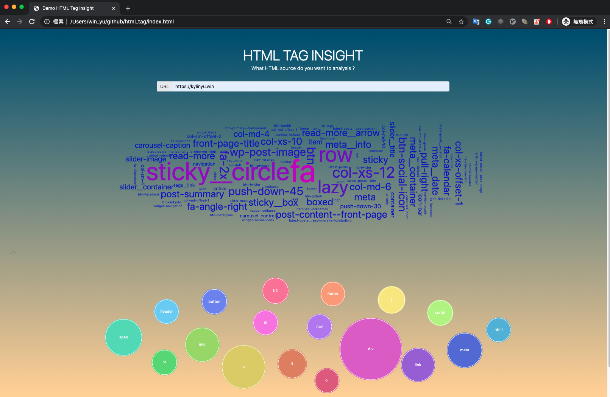

# html_attribute_insight

Welcome, this tool shows you the HTML tag/attributes insight which are:

- how many HTML tags
- how many attributes does exist in website souce code
- what the ranking for the class attributes of frequency of occurrence
- and any statistics about HTML tags

## TODO
I wanna make the file compression better. Like, sort the value of class attributes automatically,
it will make the duplicated code section as more as possible, and the compresstion rate will be higher than the random attribute order.


## Local Demo
```
make demo
```


## Usage
```
$ php demo.php
```

```
$ php demo.php https://github.com/kylinfish > Result.txt
```
